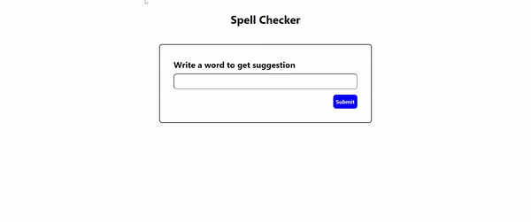

<h1 align="center">Spell Checker</h1>

Spell checker app implemented using Wagner-fisher distance algorithm between two words that calculates distance using dynmic approach with ``O(n x m)`` time complexity

## Demo

